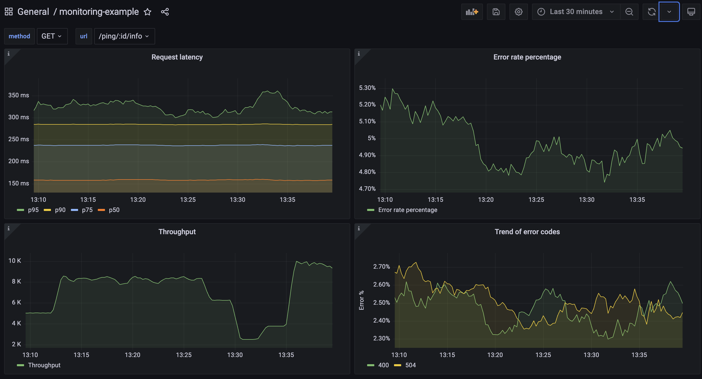

# Observability Example

## About the Project
This repo contains a comprehensive example of how to instrument a web application using [Prometheus](https://prometheus.io/) and implement some basic monitoring visualization using [Grafana](https://grafana.com/).

## Getting Started
You only need to have `docker` and `docker-compose` installed on your machine. And then you can simply run:
```
docker-compose up server
```
to run the project and `docker-compose` will take care of the rest.

To view Grafana, head to `localhost:3000`, the username is `admin` and the password is `grafana`. If you wish to interface directly with Prometheus, go to `localhost:9090`. And the server is exposed over `localhost:8080`. You can find all these details [here](docker-compose.yml).

## Project Structure and Documentation
The following should give an idea about the project structure and what each part does in case you wish to fork and edit it.
```
.
├── controllers/
│   └── controllers.go // contains an example controller
├── grafana/
│   ├── dashboards/
│   │   └── sample-dashboard.json // contains sample grafana dashboards ready to import
│   └── datasources.yml // contains grafana configurations
├── metrics/
│   ├── metrics.go // contains a sample instrumentation middleware
│   └── prometheus.go // contains prometheus related code
├── prometheus/
│   └── prometheus.yml // contains prometheus configurations
├── scripts/
│   ├── gen-traffic.sh // to run a single process that sends requests to the server
│   └── bulk-gen-traffic.sh // same as above but multi-process
├── Dockerfile // docker file for the server code
├── docker-compose.yml // contains the docker-compose manifest for the project
├── main.go // project entrypoint, also contains routes definitions
├── go.mod // project dependencies
└── go.sum // project dependencies
```

## Explaination
The follow contains a step by step explaination for how a monitoring example works.

### App instrumentation
The first phase of monitoring is instrumenting your application and collecting the needed data for monitoring. In this example, we monitor the following:
- Request count received by the server broken down by `method`, `url` and `status`.
- Request duration broken down by `method` and `url`.

We do this by injecting the `metrics.MetricsMiddleware()` middleware we developed into the `Gin` request chain. Later this middleware uses Prometheus to maintain:
- A counter `example_requests_count` for the first monitoring use case.
- A histogram `example_request_latency_ms` for the second monitoring use case.

### Visualization

And we are exposing Prometheus metrics on `host:8080/metrics` which are scraped by prometheus in a pull-model every 5 seconds.

And then we use Grafana for visulizations and it uses Prometheus as its data source. The following shows an example:



The above shows the following metrics:
1. Request latency over time tracked in terms of P50, P75, P90, P95 in millisecond.
2. Error rate percentage over time with a violation threshold set at 7.5%.
3. Request throughput over time.
4. Trend of various `http` error code produced by the server.

The dashboard has two drop down filters on top to be able to view specific endpoints. It also has a date filter to view specific date ranges. To recreate this dashboard, import this [file](grafana/dashboards/monitoring-example.json) into Grafana.

## Implementing SLOs

// TODO
