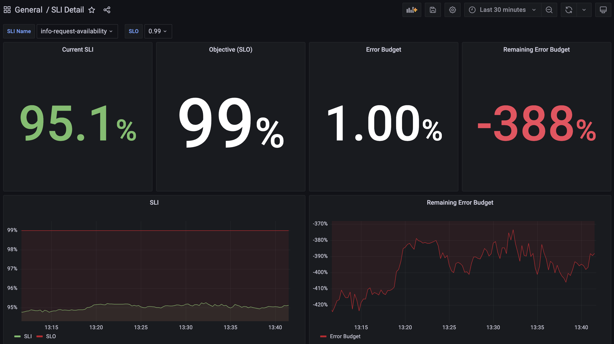
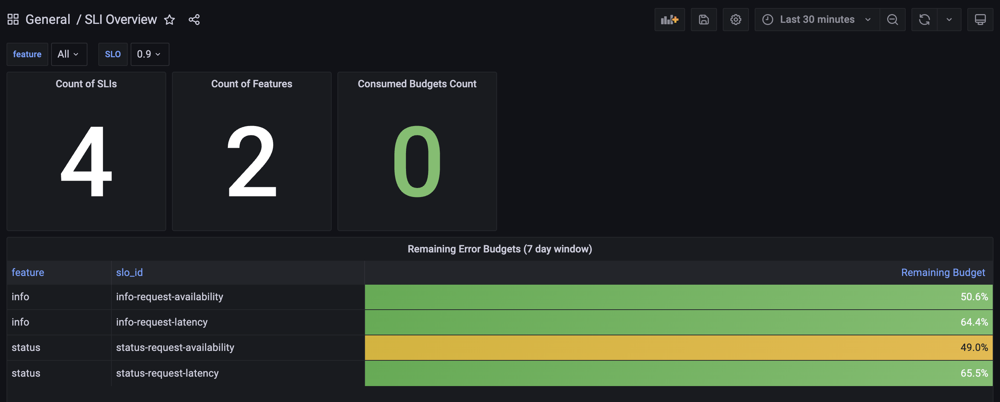
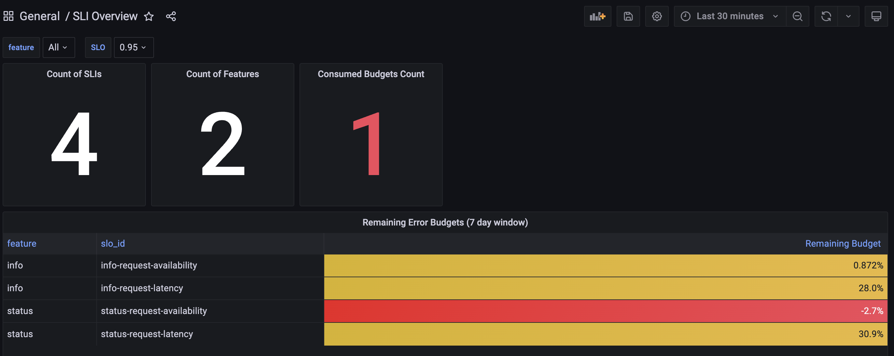

# Observability Example

## Introduction to Observability

Systems observability and monitoring are essential for maintaining IT infrastructure health and performance. Monitoring involves tracking predefined metrics and alerting on specific thresholds, while observability provides deeper insights by collecting and analyzing **logs**, **metrics**, and **traces**. This comprehensive approach helps identify root causes of issues, detect and resolve problems swiftly, and predict and prevent future incidents, enhancing the overall efficiency and resilience of IT operations.

In this project, we will only focus on **metrics** collection and maybe later on we can add logs and traces.

## About the Project
This repo contains a comprehensive example of how to instrument a web application using [Prometheus](https://prometheus.io/) and implement some basic monitoring visualization using [Grafana](https://grafana.com/).

## Getting Started
You only need to have `docker` and `docker-compose` installed on your machine. And then you can simply run:
```
docker-compose up server
```
to run the project and `docker-compose` will take care of the rest.

To view Grafana, head to `localhost:3000`, the username is `admin` and the password is `grafana`. If you wish to interface directly with Prometheus, go to `localhost:9090`. And the server is exposed over `localhost:8080`. You can find all these details [here](docker-compose.yml).

## Project Structure and Documentation
The following should give an idea about the project structure and what each part does in case you wish to fork and edit it.
```
.
├── controllers/
│   └── controllers.go // contains an example controller
├── grafana/
│   ├── dashboards/
│   │   └── sample-dashboard.json // contains sample grafana dashboards ready to import
│   └── datasources.yml // contains grafana configurations
├── metrics/
│   ├── metrics.go // contains a sample instrumentation middleware
│   └── prometheus.go // contains prometheus related code
├── prometheus/
│   └── prometheus.yml // contains prometheus configurations
├── scripts/
│   ├── gen-traffic.sh // to run a single process that sends requests to the server
│   └── bulk-gen-traffic.sh // same as above but multi-process
├── Dockerfile // docker file for the server code
├── docker-compose.yml // contains the docker-compose manifest for the project
├── main.go // project entrypoint, also contains routes definitions
├── go.mod // project dependencies
└── go.sum // project dependencies
```

## Explanation

The following contains a step by step explanation for how a monitoring example works.

### App instrumentation

The first phase of monitoring is instrumenting your application and collecting the needed data for monitoring. In this example, we monitor the following:
- Request count received by the server broken down by `method`, `url` and `status`.
- Request duration broken down by `method` and `url`.

We do this by injecting the `metrics.MetricsMiddleware()` middleware we developed into the `Gin` request chain. Later this middleware uses Prometheus to maintain:
- A counter `example_requests_count` for the first monitoring use case.
- A histogram `example_request_latency_ms` for the second monitoring use case.

### Visualization

And we are exposing Prometheus metrics on `host:8080/metrics` which are scraped by prometheus in a pull-model every 5 seconds.

And then we use Grafana for visualization and it uses Prometheus as its data source. The following shows an example:


The above shows the following metrics:
1. Request latency over time tracked in terms of P50, P75, P90, P95 in millisecond.
2. Error rate percentage over time.
3. Request throughput over time.
4. Trend of various `http` error code produced by the server.

The dashboard has two drop down filters on top to be able to view specific endpoints. It also has a date filter to view specific date ranges.

## Introduction to SLOs

In the previous section we talked about adding basic instrumentation which can be useful to keep on server metrics such as latency and error rate. But bare metrics are somewhat hard to reason about when creating service level agreements. For example, if we say we have an SLA that latency should be under 300ms, would that mean that 100% of all requests should have latencies under 300ms? It's an unreasonable expectation and quite hard to track.

SLOs are used to define service objectives in a more realistic and easy to reason about way. For example, if we define an SLO that 90% of all requests should have latency less than 300ms, it's not only a more reasonable expectation, it also reduces the whole monitoring to a single number that's easy to track and reason about.

SLOs also allow us to define error budgets which indicate how unreliable a service is allowed to be. This is great for removing the politics from negotiations between the SREs and the product developers when deciding how much risk to allow.

### Definitions

We will use the following definitions:
1. **SLO**: It's short for Service Level Objective and it defines the goal a service needs achieve.
2. **SLI**: Its short for Service Level Indicator and it shows how well the service is doing when it comes to achieving its set SLO. This is calculated as `number_of_good_events / total_number_of_events`.
3. **Error Budget**: Defines how unreliable a service is allowed to be. You can think of this like how much slack is allowed when it comes to meeting the set SLO. It's calculated as `1 - SLO`.
4. **Remaining Error Budget**: Defines how close a service is when it comes to consuming its set Error Budget. It's calculated as `1 - ((1 - SLI) / (1 - SLO))`.
5. **Compliance Window**: Defines the time frame over which the SLO is calculated which is intended to enforce recency.

### SLO Example

Let's take the following example in order to better illustrate the idea. Let's assume we have an SLO that says: "Service time should be at least 99%", so:
- **SLO** = 99%
- **Error Budget** = 1 - SLO = 100 - 99 = 1%

Let's assume that the current SLI is around 95% which means that the service uptime is 95% which also means that the number of good events (service is working fine) divided by the total number of events (all requests being handled by the service) is 95%.

This automatically means that we are in violation of our SLO. The **Remaining Error Budget** can be calculated as follows:
- `1 - SLI` to see how far are we from a perfect 100% uptime. In this case it's `1 - 0.95 = 0.05`
- `1 - SLO` also know as the **Error Budget** which is `0.01` in this case.
- `(1 - SLI) / (1 - SLO)` to see how bad did we do compared to a perfect 100% uptime, in this case we are 5 (`0.05 / 0.01`) times as far from perfect.
- `1 - ((1 - SLI) / (1 - SLO))` to see how far are we from the allowed error budget, in this case we are 4 times (`-400%`) as far (it's allowed to be far by 1% and we are far by 5% from the perfect 100%).



The above screenshot shows how the details of such an SLO will look like on the Grafana dashboard.

### Implementing SLOs

In this demo, we implement 2 SLOs per endpoint, one for availability and another for latency. We use the same metrics we exposed earlier in the instrumentation example to implement SLOs.

Since we want our SLOs to be continuously evaluated and at low cost, we use [Prometheus Recording Rules](https://prometheus.io/docs/prometheus/latest/configuration/recording_rules) to calculate the SLI overtime. You can see all queries [here](prometheus/rules.yml).

We have 2 dashboards for SLOs:
- Overview: shows all SLOs we have with a quick summary for each.
- Details: allows to dig deeper into the details of a specific SLO.

**Overview Dashboard**



The above screenshot shows the overview dashboard that lists our 4 SLOs alongside how many Error Budgets are consumed and the Remaining Error Budget for each SLO. It also allows changing the SLO from a drop down.



For example, if we use the SLO dropdown to change it to 95% instead of 90%, we will get a more strict SLO as shown above. In fact we have one consumed error budget in that case.

**Details Dashboard**


The above screenshot shows the SLO details dashboard which offers more information regarding how the SLO is doing over time which can be very useful to correlate regressions to maybe a release that happened around that time or something similar.

## Testing

To generate synthetic random traffic in order to test any of the above, you can run:
```
chmod +x scripts/bulk-gen-traffic.sh

./bulk-gen-traffic.sh 100
```
where `100` is the concurrency factor, you can decrease or increase this as you wish.

## Contribution

Feel free to fork this repo and create a pull request with whatever addition you wish to contribute!
